# [Rhizobia Analyzer](https://umn-vr.github.io/Rhizobia-Analyzer/HTML/select_crop_num.html)

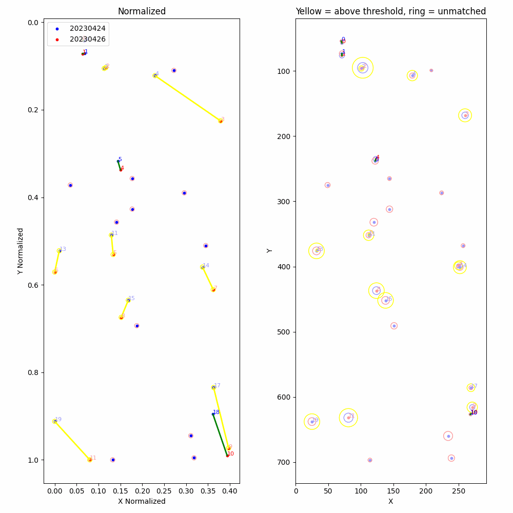


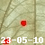

[This](https://umn-vr.github.io/Rhizobia-Analyzer/HTML/select_crop_num.html) is a tool designed to automate the analysis of Rhizobia images taken over a long period of time. 

How go use the visualizer tool to view the results:

1. Open the ['select_crop_num.html'](https://umn-vr.github.io/Rhizobia-Analyzer/HTML/select_crop_num.html) file in your browser

2. Select the crop number you want to view the results for

3. Select the date you want to view the results for

4. Select the nodule that you want to view the results for


<br>


## Data Processing Pipeline

### Step 1: Get Images of water pouches containing Rhizobia.

We place a Raspberry Pi Camera in a photo rig where a water pouch containing Rhizobia is placed. 

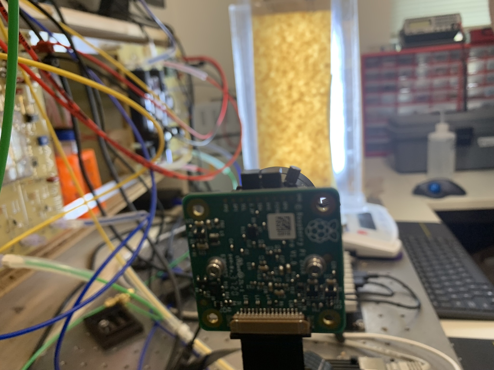

The camera takes a picture against a white LED light panel.

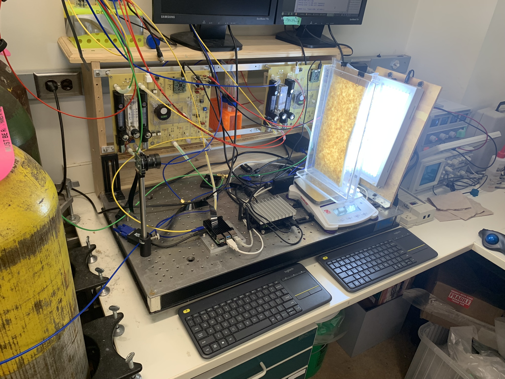


Due to the arrangement of the light panel behind the water pouch, the light that hits the camera has passed through the water pouch. This allows for reliable extraction of data from the images.

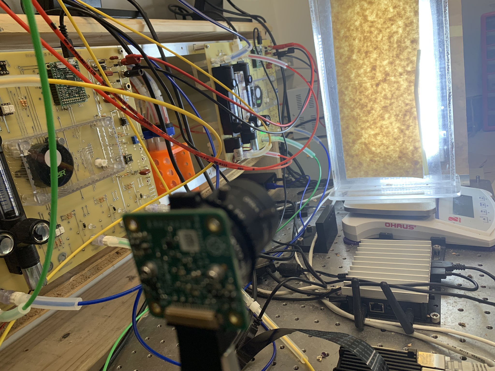

The staff take a picture of each water pouch every couple of days. 

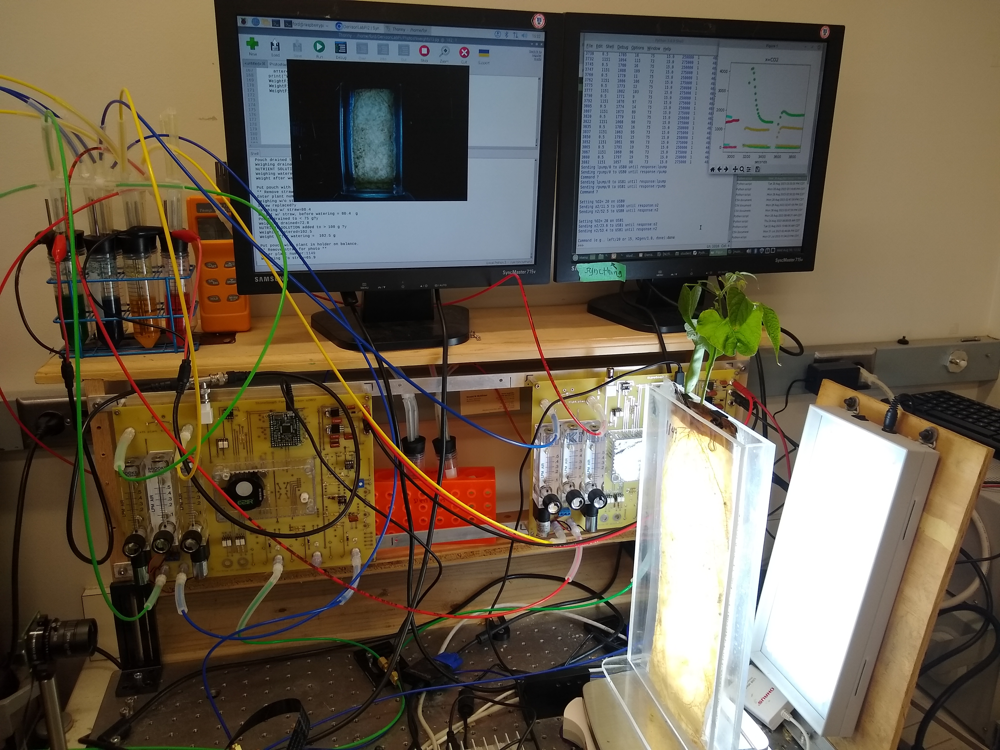

The images are gathered until the end of the experiment.

Then the images are then uploaded to a server for analysis.

<br>

### 2: Run [Perspective Correction](https://github.com/UMN-VR/Perspective-Correction)

We take the images and run them through the [Perspective Correction](https://github.com/UMN-VR/Perspective-Correction) tool to remove the perspective distortion from varying camera angles & distances. 

This will chop up the images into smaller images of size 1410x600. 

<br>

### Step 3: Run Nodule Detection 

Then we run [root painter](https://github.com/Abe404/root_painter) on the corrected images.

The output of root_painter is a CSV file that contains the number of nodules in each image, as well as the composite images showing the red mask and the original image. 

<br>

### Step 4: Run [Root Painter CSV to JSON](https://github.com/UMN-VR/Root_Painter_CSV_to_JSON)

The CSV file and images are then processed by the [Root Painter CSV to JSON](https://github.com/UMN-VR/Root_Painter_CSV_to_JSON) tool to generate a bunch of folders containing JSON files that contain the data for each nodule as well as the composite images. 

The ['output'](https://github.com/UMN-VR/Root_Painter_CSV_to_JSON/tree/main/output) folder from [Root Painter CSV to JSON](https://github.com/UMN-VR/Root_Painter_CSV_to_JSON) is the ['data'](https://github.com/UMN-VR/Rhizobia-Analyzer/tree/main/data) folder for this tool.

<br>

### Step 5: Run [Rhizobia Analyzer](

```bash
python3 main.py
```
You should see a prompt asking you if you would like to clear the output dir:

```
--------------------------------------------------
Starting Rhizobia Analyser v8.0...
It is recommended to clear the output directory before running this script.
Would you like to clear the output directory? (y/n):
```

After that you will be prompted to type the path to the directory containing the JSON files that you want to process:

```
Enter crop folder dir ie: 'data', 'data/crop1000', etc. (or 'exit' to stop):
```


The tool is made up of two parts: The Python Scripts and the HTML files. The Python Scripts are used to process the images and the HTML files are used to display the results.

You can open up the HTML visualizer either of 3 ways:

1. This is a github pages repo, git hosts a web server for us that will serve the contents of this repo. You may go to this link to try it out:
[https://umn-vr.github.io/Rhizobia-Analyzer/HTML/select_crop_num.html](https://umn-vr.github.io/Rhizobia-Analyzer/HTML/select_crop_num.html)

2. You can download the repo and open the HTML files locally. If you want to open the HTML files locally, you might want to run a local server, or if you don't feel like doing that Disable CORS(Cross-Origin Resource Sharing) restrictions in your browser. If you disable CORS restrictions make sure to re-enable it after you are done, there could be security issues if you leave it disabled.

    Start a local server to host the HTML files:

    1. Install Python 3.10.0 or higher
    2. Open a terminal and navigate to the directory where you have the HTML files
    3. Run `python -m http.server 8000` or `/usr/local/bin/python3.10 -m http.server 8000` if you have multiple versions of Python installed
    4. Open a browser and go to [http://localhost:8000/](http://localhost:8000/)
    5. Navigate to the HTML Directory and select the HTML file [select_crop_num.html](http://localhost:8000/HTML/select_crop_num.html)

<br>

## Impact of Rhizobia Research

By facilitating a deeper understanding and more efficient use of Rhizobia in crop production, these tools support the shift towards more sustainable, low-impact farming practices.


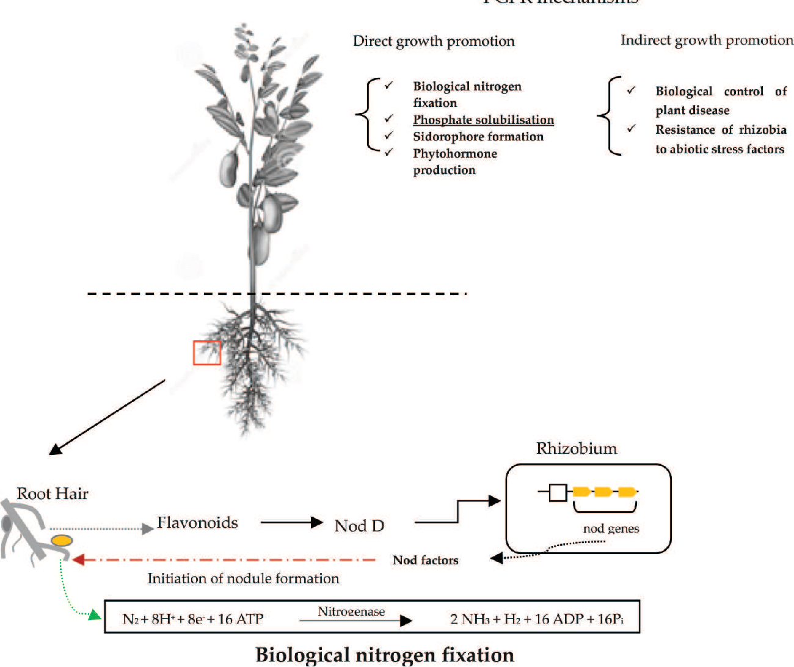
[Rhizobia N Fixation](https://www.semanticscholar.org/reader/efbd5e99a06c031c81d2f4e551e614eab2e281a1)

<br>


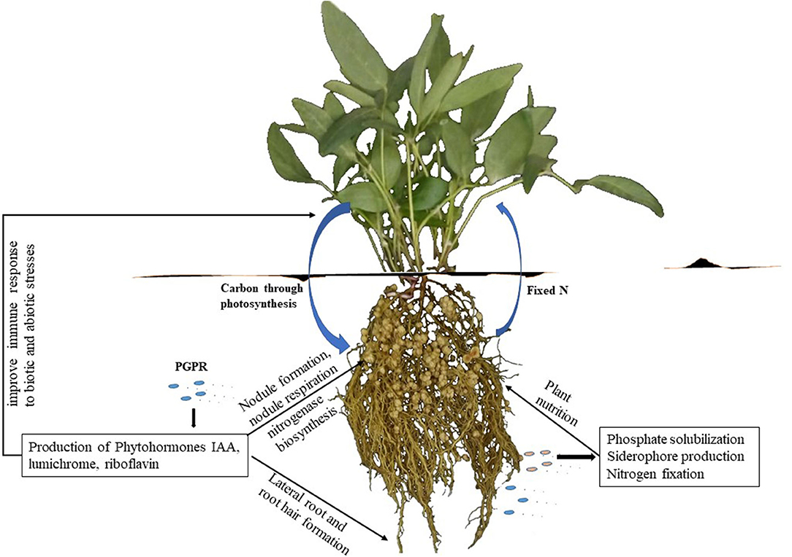
[Rhizobia as a Source of Plant Growth-Promoting Molecules](https://www.frontiersin.org/articles/10.3389/fsufs.2020.619676/full)

### Rhizobia as Sustainable Nitrogen Fixers
Rhizobia bacteria form symbiotic relationships with leguminous plants, facilitating a natural process of nitrogen fixation. These bacteria convert atmospheric nitrogen into a form that plants can use. This process is a sustainable and eco-friendly alternative to synthetic fertilizers, reducing the need for chemical inputs in agriculture. Rhizobia's role in enhancing soil fertility and plant nutrition is especially crucial in low-resource settings or organic farming.


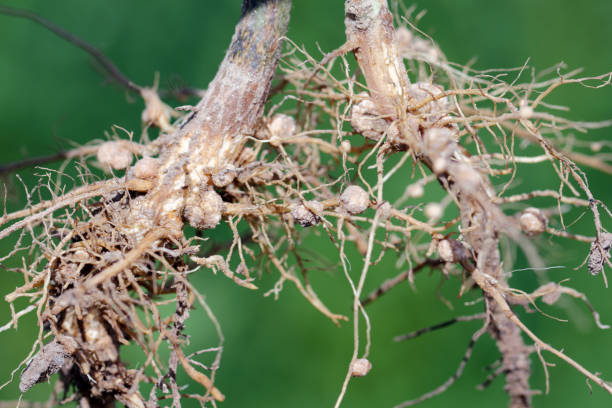

<br>

### Importance of Nitrogen for Plants
Nitrogen is a vital nutrient for plants, crucial for the synthesis of proteins, nucleic acids, and chlorophyll. It's a core component of amino acids, the building blocks of proteins, which are essential for the growth and development of plant tissues. Nitrogen also plays a significant role in photosynthesis, the process by which plants convert light energy into chemical energy.

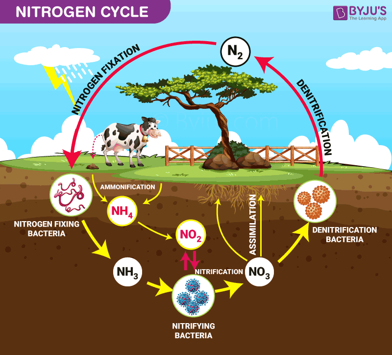
[Nitrogen Cycle](https://byjus.com/biology/nitrogen-cycle/)

<br>

### Environmental and Economic Impact of Fossil Fuel Fertilizers

[Nitrogen: The environmental crisis you haven’t heard of yet](https://news.mongabay.com/2021/09/nitrogen-the-environmental-crisis-you-havent-heard-of-yet/#:~:text=,NC%202.0%E2%80%A0creativecommons.org%E3%80%91)


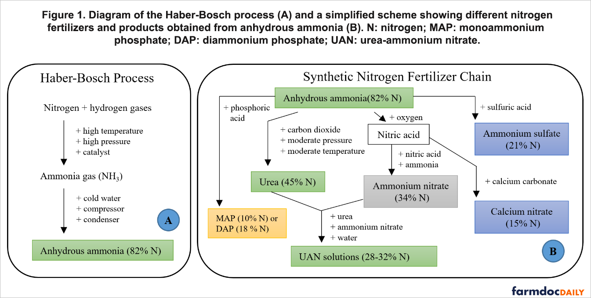
[Synthetic Nitrogen Fertilizer](https://fmr.org/updates/water-legislative/how-heat-waves-fuel-toxic-algae-blooms-minnesota-waters)


Synthetic fertilizers, often derived from fossil fuels, have significant environmental and economic drawbacks. 

[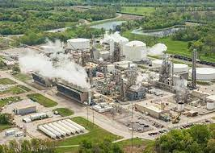](https://ens-newswire.com/us-fertilizer-plants-emit-100-times-the-methane-reported/)


They contribute to greenhouse gas emissions both in their production and use. 

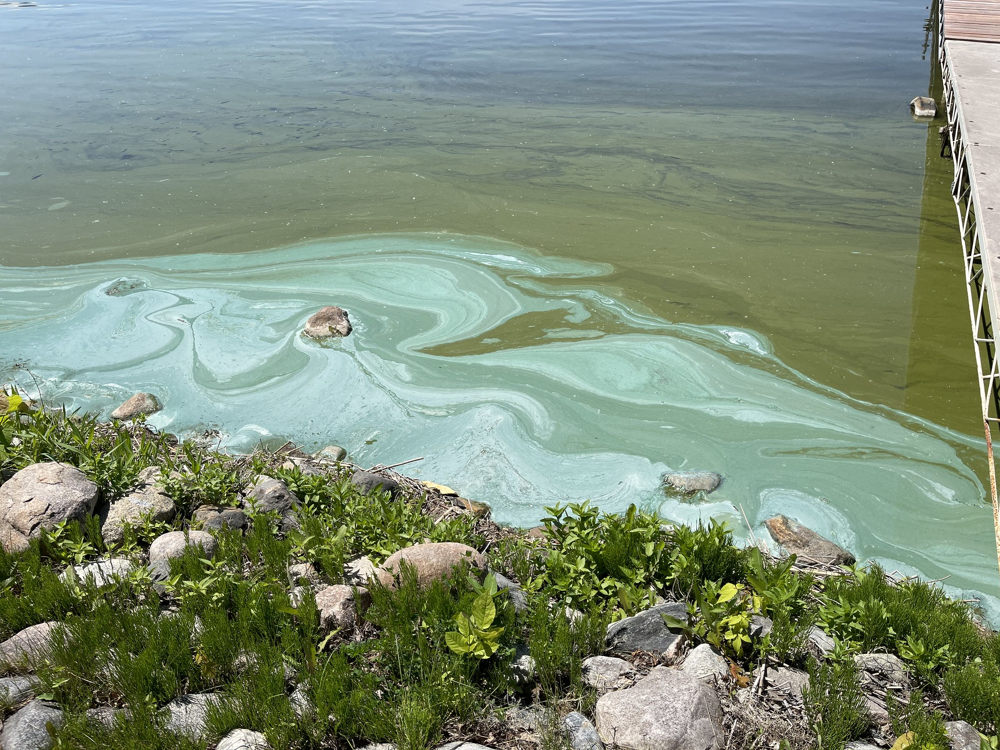
[Toxic algae blooms in MN waters](https://fmr.org/updates/water-legislative/how-heat-waves-fuel-toxic-algae-blooms-minnesota-waters)


Nitrogen from these fertilizers can leach into water bodies, causing eutrophication, harmful algal blooms, and water quality degradation. 

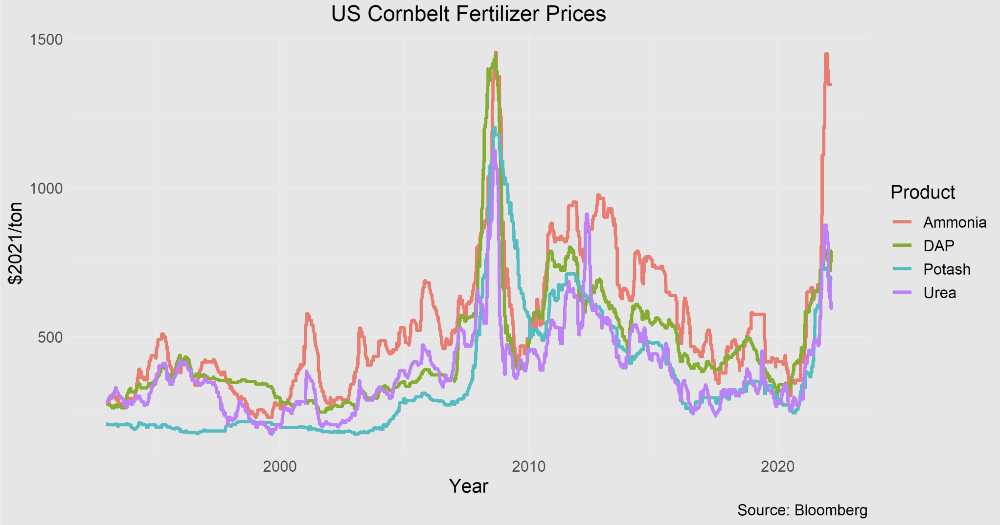
[Synthetic Fertilizer Prices](https://asmith.ucdavis.edu/news/story-rising-fertilizer-prices)

Economically, the cost of synthetic fertilizers is subject to the volatility of oil prices and can be prohibitively expensive for small-scale or resource-poor farmers. 


[](https://48hills.org/2023/08/reflections-on-an-explosion-the-beirut-disaster-three-years-on/)

Fertilizer can also be highly explosive substance, posing a safety risk to workers and communities before it is even used. 


<br>

### Rhizobia as a Tool for Sustainable Agriculture

#### Broader Implications for Food Security and Climate Change
Integrating Rhizobia into agricultural practices can significantly contribute to global food security by increasing crop yields in a sustainable manner, especially in regions with limited access to synthetic fertilizers. Additionally, by reducing greenhouse gas emissions and enhancing soil carbon sequestration, this approach aligns with global efforts to mitigate climate change.


### Objective of the Rhizobia Analyzer Software

#### Software Goals
The primary objective of the Rhizobia Analyzer software is to develop an advanced tool that can:
1. **Analyze Rhizobia Growth**: Determine the growth rate and health of Rhizobia within nodules.
2. **Monitor Nodule Health**: Identify when and why plants may decide to deactivate (kill) certain nodules.
3. **Evaluate Nitrogen Uptake**: Assess which treatments lead to increases in nitrogen uptake by plants.

#### Methodology
- **Tracking Nodule Size Over Time**: The software meticulously tracks the size of nodules over time across thousands of crops. Each crop receives a specific treatment to test its effectiveness.
- **Data-Driven Analysis**: Leveraging the captured images and data, the software utilizes algorithms to measure and compare the growth rates and sizes of nodules, providing insights into the effectiveness of different treatments.
- **Treatment Evaluation**: By correlating nodule health and plant growth data, the software helps identify which treatments optimize nitrogen fixation and overall plant health.


Made in colaboration with [R Ford Denison](https://darwinianagriculture.com/)