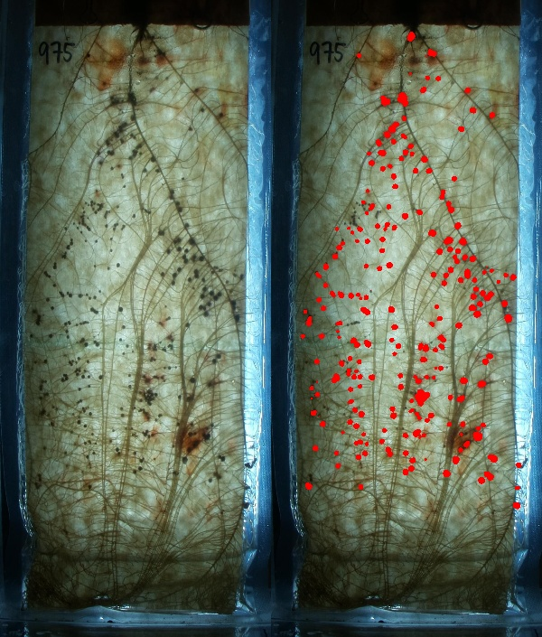

# About Rhizobia Analyzer

## Inputs:
[Corrected, Segmented Image from Root_Painter](data/crop975/20230607.jpg)




```
[
 {
  "x": 309.42,
  "y": 80.28,
  "d": 19.0492,
  "a": 285.0,
  "p": 61.6985,
  "e": 0.69092
 },
 {
  "x": 355.58,
  "y": 116.48,
  "d": 17.9834,
  "a": 254.0,
  "p": 60.2843,
  "e": 0.769163
 },
 {
  "x": 194.32,
  "y": 122.03,
  "d": 10.8817,
  "a": 93.0,
  "p": 32.7279,
  "e": 0.38755
 },

 ...
```


## Outputs:
